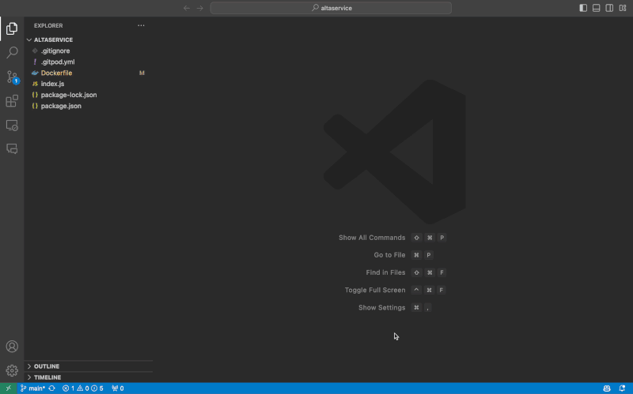

# Docker AI

At Docker, our community of developers is our most valued partnership. By being part of this EA program, you’re agreeing to collaborate with us in building solutions that increase your time spent on innovation and less time on everything else! 

You’ve been selected to participate in the Docker AI initial market research feedback based on your submission. We know you’re busy and value your time, so here’s what you can expect and plan for:

1. Docker will provide you access to this product and simple instructions to get started.
2. Your feedback is critical, thus participating in (2) interviews and (2) surveys are required to maintain access to the product.
3. Participation in (2) interviews of 30 to 45 min max in duration; we’re happy to work around your schedule.
4. Surveys, which will take 3 to 5 minutes to complete, approximately every 1 to 2 weeks for the first 90 days of usage; please complete the surveys as soon as possible.
5. We may also send occasional requests for feedback in varying formats after the first 3 months, but access isn’t contingent on participation in these. If you have the time, we’d greatly appreciate your thoughts.

And that’s about it! After just 90 minutes of your time over a few months, you’ll have assisted us (pun intended) in developing a great solution and user experience. Let’s get started! 

## VSCode Extension Setup & Installation

### Installation Instructions

#### Step 1: Download Extension File
Download [docker-ai.vsix](https://github.com/docker/docker-ai/releases/download/pre-release/docker-ai.vsix) pre-release file 

#### Step 2: Enable Extension in VSCode
**Option 1: Via the command line**

Must have VSCode code command in PATH:
`code --install-extension <PATH_TO_DOWNLOADED_.VSIX> --force`

If you don’t have the code command, you can enable it in VSCode or skip to Option 2 below.

**Option 2: Via the command palette in VSCode**
1. Type `>` into top search bar
2. **Shortcut: Press ⇧⌘P (OSX) or CTRL⇧P (Win/Linux)**
3. Use command Extensions: Install from VSIX...
4. Select .VSIX file downloaded in Step 1
5. Hit the “Reload Now” button in the notification at the bottom right corner

#### Step 3: Open the Command Palette and select Ask Docker AI for a list of questions to get started

#### Valuable Links
Install process demo (30 sec max)
Ask Assistant demo (Summarization)

